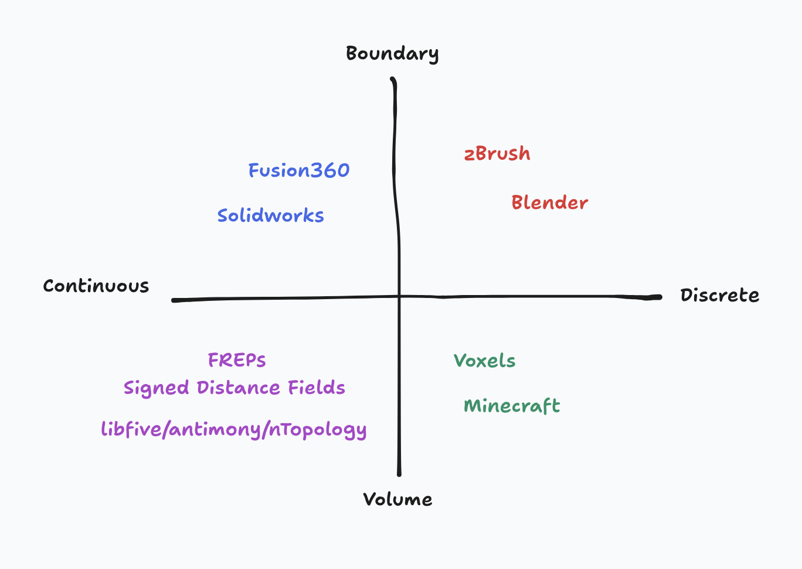
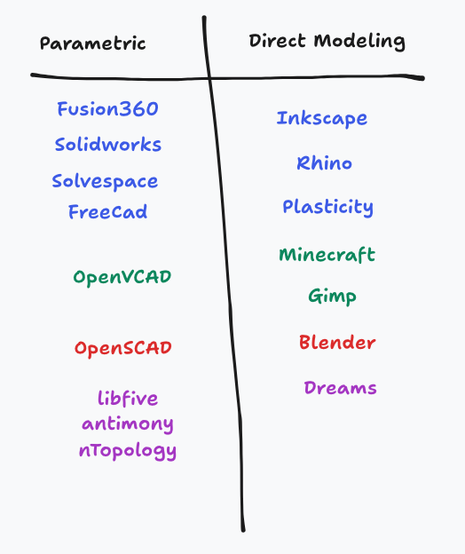
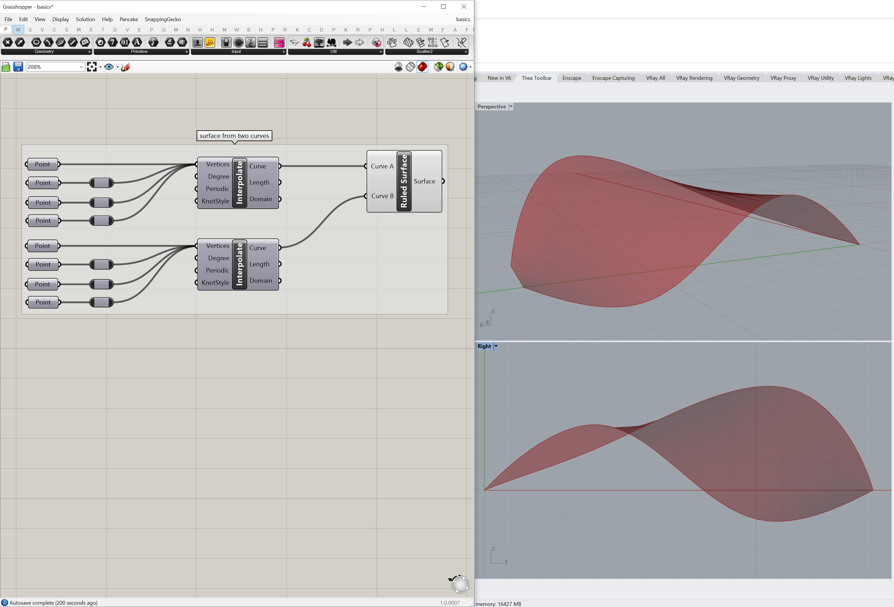
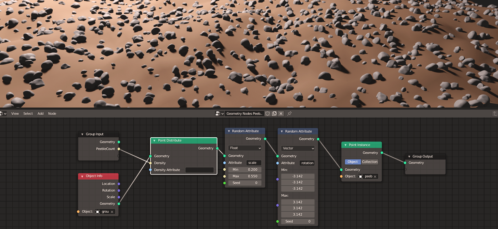
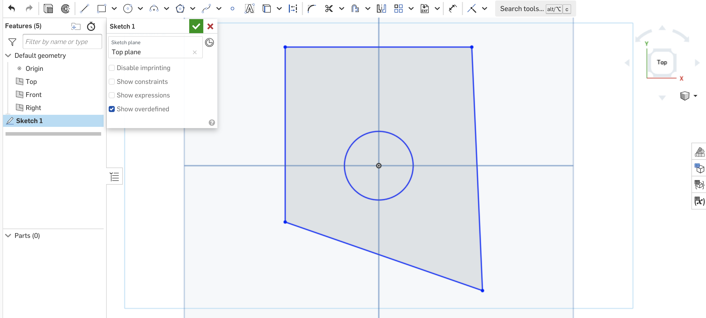

# CAD in 1 Hour

> Check out the site at [leomcelroy.com/cad-in-1-hour](https://leomcelroy.com/cad-in-1-hour)

Below is the landing page.

> This write up was originally written for [MIT's How to Make Something that Makes (almost) Anything class](https://fab.cba.mit.edu/classes/865.24/index.html) by Leo McElroy, Lingdong Huang, and Niklas Hagemann.
> The [version presented to the class is available here](https://fab.cba.mit.edu/classes/865.24/topics/design-tools/) with a [recording of the lecture available here](https://mit.zoom.us/rec/play/kY5T2RxteJq3wB2L9UOezzsS7mb54Ba3aqKuVYxqk8e92XZYpoZjR1DN0pFLE7IfVyfVl6Xmhh1fDD5T.i78AWp-Kgrm6Ybpe?canPlayFromShare=true&from=share_recording_detail&continueMode=true&componentName=rec-play&originRequestUrl=https%3A%2F%2Fmit.zoom.us%2Frec%2Fshare%2FmSbxXU1ap3euZp8TjonDAqmOeXrBUwPXN9e-dJ2e2kWVZ_HxQu6PQFhioWVrFPtt.O3SoIRlOUhdLGrsS).
> I've re-hosted the portions of the lecture I (Leo) wrote to continue developing them further.
> I still link to the exceptional Ray Marching and Anatomy of an STEP demos developed by Lingdong.

### The Lay of the Land

Computer Aided Design (CAD) tools can be categorized in a variety of different ways.
At a high-level you can separate tools based on how they represent geometry, 
such as whether objects are modeled by their exterior geometry or the interior space the object takes up.
In other words is the object defined by its boundary or its volume.
Is that geometric representation continuous or discrete (and limited to a particular resolution)?

Below we depict some CAD tools categorized by these dimensions (boundary/volume, continuous/discrete):

Note that these categorizations are not formal and some tools may blur the lines between them or support multiple
representations. 
For example standard **solid** modeling tools for mechanical engineer (such as SolidWorks or Fusion360) use boundary representations (B-Reps).
These tools are designed to create solid models (as the name suggests) with watertight or manifold geometry.
Some CAD tools restrict users to designing objects which are solid even though the underlying representation could describe non-solid geometry.

Another useful categorization of tools is parametric versus direct modeling (or non-parametric).

In direct modeling tools users specify geometry manually, whereas in parametric design
tools geometry can by derived from other features or abstract operations.

Parameterization can take many forms.
One of the most general and common ways of parameterizing systems is simply coding.

Of course programs can be used to represent practically anything, including 3D designs.

This is demonstrated below with a simple OpenSCAD design.

To designers using Rhino parameterization may come from plug-ins such as Grasshopper (check out [Nodi3D](https://nodi3d.com/) for something similar which is web-based and open source).

A similar dataflow programming environment could be familiar to an artist using Blender's geometry nodes.

To mechanical engineers parameterization generally comes from geometric constraint solvers and timelines of operations.
We'll have a lot to say about constraint solvers later in this write-up.

We're going to introduce you to some of the key concepts needed to create design tools.
We will introduce many of these concepts by demonstrating how to implement minimal versions
of them in code (JavaScript!). 
We will cover how to represent solids with distance fields, how to mesh those fields, some history of modern solid modeling CAD tools, constraint solvers, B-Reps through the context of the step format, and survey a few futuristic generative design tools. 

