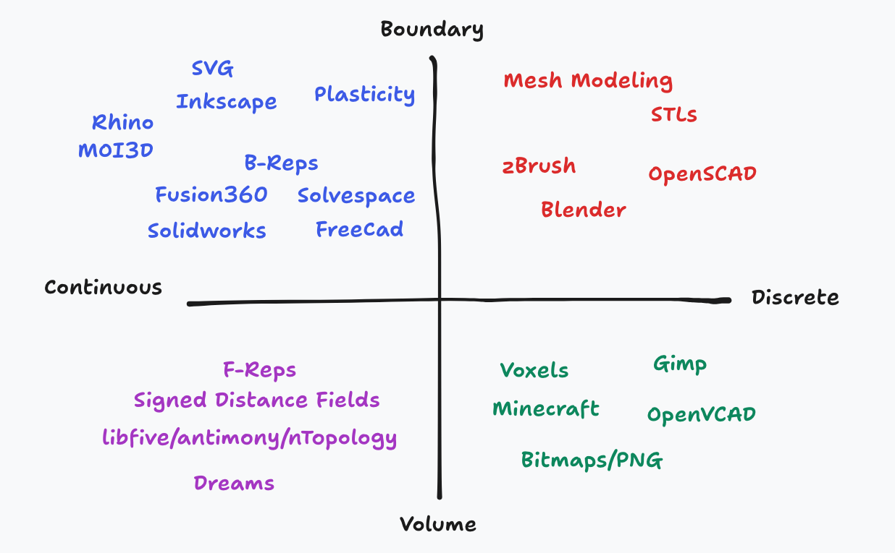

# CAD in 1 Hour

### The Lay of the Land

Computer Aided Design (CAD) tools can be categorized in a variety of different ways.
At a high-level you can separate tools based on how they represent geometry, 
such as whether objects are modeled by their exterior geometry or the interior space the object takes up.
In other words is the object defined by its boundary or its volume.
Is that geometric representation continous or discrete and limited to a particular resolution.

Below we depict some CAD tools categorized by these dimensions (boundary/volume, discrete/continous):



Note that these categorizations are not formal and some tools may blur the lines between them or support multiple
representations. 
For example standard **solid** modeling tools for mechanical engineer (such as SolidWorks or Fusion360) use boundary representations (BREPs).
These tools are designed to create solid models (as the name suggests) with watertight or manifold geometry.
The interfaces restrict users to designing objects which are solid even though the underlying boundary representation can support non-solid geometry.

Another useful categorization of tools is parametric versus direct modelling (or non-parametric).


In direct modelling tools users specify geometry manually, whereas in parametric design
tools geometry can by derived from other features or abstract operations.

Parameterization can take many forms.
One of the most general and common ways of parameterizing systems is simply coding.

Of course programs can be used to represent practically anything, including 3D designs.

This is demonstrated below with a simple OpenSCAD design.


To designers using Rhino parameterization may come from plug-ins such as Grasshopper (or Nodi3D).


A similar dataflow programming environment could be find by an artist using Blender's geometry nodes.


To mechanical engineers parameterization generally comes from geometric constraint solvers and timelines of operations.
We'll have a lot to say about constraint solvrs later in this write-up.


We're going to introduce you to some of the key concepts needed to create design tools.
We will introduce many of these concepts by demonstrating how to implement minimal (but often practical) versions
of them in code (JavaScript!). 
We will cover how to represent solids with analytical distance fields, how to mesh those fields, some history of modern solid modelling CAD tools, BREPs through the context of the step format, and constraint solvers. 

Let's get into it.

### Function Representations/Distance Fields

Perhaps one of the simplest ways to describe an object is with closed form expression.

Let's start in 2D. If we wanted to describe a circle we can just write down the equation for a circle.


Let's do that in a format we can actually make use of.

```js

function circle(x, y, r) {
  return r - Math.sqrt(x**2 + y**2)
}
```

Great but how can we actually see that?

Well the simplest approach would be to pick some sampling resolution.

When the distance is negative we'll consider ourselves inside of the the circle, when positive we'll be outside.

```js
// rendering code in 2d
```

Treating this expression as an inequality rather than a numeric value is typically considered the distinction between a functional representation (FRep) and a SDF (signed distance field).
SDFs are the terminology more commonly used in shader art communities such as (ShaderToy)[https://www.shadertoy.com/].


Let's do that in 3D and make a sphere.

```js

function sphereSDF(x, y, z, r) {
  return r - Math.sqrt(x**2 + y**2 + z**2)
}
```

But how can we visualize this sphere in 3D. 
The most common approach is to use ray marching.

__EXPLAIN RAY MARCHING__

__DEMO OF SPHERE__

One of the major advantages of having analytical represenations of our objects is it's very easy to perfrom constructive solid geometry (CSG).
This basically means we can perform boolean algebra on our shapes (intersections, unions, differences).

In code we can express these operations with min and max operations on distances evaluated from two distance fields.

```js
function intersectSDF(distA, distB) {
    return max(distA, distB);
}

function unionSDF(distA, distB) {
    return min(distA, distB);
}

function differenceSDF(distA, distB) {
    return max(distA, -distB);
}
```

Here is a demonstration of applying these operations to our circle and a rectangle.

First we'll need a function to describe a rectangle:

```js
function rectangleSDF(x, y, cx, cy, w, h) {
    const dx = Math.abs(x - cx) - w / 2;
    const dy = Math.abs(y - cy) - h / 2;

    const outsideDistance = Math.sqrt(Math.max(dx, 0) ** 2 + Math.max(dy, 0) ** 2);
    const insideDistance = Math.min(Math.max(dx, dy), 0);

    return outsideDistance + insideDistance;
}
``` 

Now let's apply each CSG operation to our two shapes:

```js
function myShape(x, y) {
  const myCircle = circle(x, y, 0, 0, 5);
  const myRect = rectangle(x, y, 0, 0, 10, 3);

  return intersectSDF(myCircle, myRect);
}
```

__Display above__

```js
function myShape(x, y) {
  const myCircle = circle(x, y, 0, 0, 5);
  const myRect = rectangle(x, y, 0, 0, 10, 3);

  return unionSDF(myCircle, myRect);
}
```

__Display above__

```js
function myShape(x, y) {
  const myCircle = circle(x, y, 0, 0, 5);
  const myRect = rectangle(x, y, 0, 0, 10, 3);

  return differenceSDF(myCircle, myRect);
}
```

__Display above__

All of the operations work just as well in 3D!
It's also possible to perform non-standard transformations like twists or smooth blends.

__SHOW SMOOTH BLEND__

If we want to do something with our geometry (like transfer it to a slicing program or some other tool) we'll need to convert it to a discretized format.
We can refer to this operation as "meshing" which can be performed in different dimensions.

Let's start by meshing our 2D shape.

A very common algorithm for meshing is called Marching Cubes.

__EXPLAIN MARCHING CUBES__

Run it on our shapes.

We can improve marching cubes by interpolating along the edge of our rules.

__DUAL CONTOURING__

Notice that the corners of our designs are getting lopped off.
We can address this by using the dual graph of our discretized lattice instead.

__DEMO DUAL CONTOURING__


__QUADTREES?__

__SHADER TOY__
__INIGO QUILEZ BLOG__
__HISTORY AT CBA__
__MATT KEETER WORK__

### STLs

Let's run marching cubes in 3D on our sphere. 
This as given us an STL which is basically just a collection of triangles. 

### Voxels

We could generate a different type of 3D representation by filling our solid model with voxels.
This is very similar to how we were rendering our 2D distance fields.

As we demonstrated before there are lots of tools which use these types (SDFs, voxels, meshes) of geometric representations 
but typical solid modelling CAD tools do something different let's dig into what.

### Some (convoluted) CAD History

Solid modelling CAD tools standard for mechanical design can be defined by two technologies which constitute their "kernels": Boundary Representations (B-Reps) and geometric constraint solvers.

B-Reps were introduced by Ian Braid in the 1970s while he was a PhD student at Cambridge University's Computet-Aided Design Group.

He published on this work in his thesis titled _Designing with Volumes_ and also in papers such as [_The Synthesis of Solids Bounded by Many Faces_](./papers/braid-solids.pdf).

Ian took over leading the CAD Group in 1975. 

In 1974 Ian and three colleagues (including Charles Lang and Alan Grayer) created the company Shape Data Ltd to commercialize the CAD groups research. 
Ian joined Shape Data full time in 1980. 
In 1978 the company released Romulus the world's first commercial solid modelling kernel.

In 1986 Ian and two other founders left to start Three-Space Ltd. 
Three-Space Ltd. created ACIS (Alan, Charles, Ian's System)

Interesting ACIS was liscenced to Spatial Corp. which was acquired by Dassault Systemes.

And Shape Data developed Parasolid which was acquired by Siemens.

So to review: 

Alan, Ian and Charles -> Shape Data (Parasolid) -> Siemens

Alan, Ian and Charles -> Three-Space Ltd. (ACIS) -> Spatial Corp. -> Dassault Systemes

ACIS 7.0 was forked -> Autodesk ShapeManager

Dassault Systemes makes Solidworks which uses Parasolid (owned by Siemens).


On top of all this in 1989 D-Cubed Ltd was founded and created DCM (Dimensional Constraint Manager).
This is one of the first commercial geometric constraint solvers and it's now owned by Siemens.

According to [this Hacker News commenter](https://news.ycombinator.com/item?id=30625341) (who worked at D-Cubed) it's also liscenced by most major CAD developers.


On the same thread we also find this comment:


You are in fact not the only one that finds it crazy that these incredibly important technologies seem to be developed and understood by very few. 

Interestingly there were more former D-Cubed Ltd employees wandering the comments sections:


### Boundary Representation (B-Rep)

### Geometric Constraint Solvers

Constraint solvers are 

Christoph M. Hoffmann

__Numerical__

__Graph Constructive__

As previously mentioned the first commerical constraint solver was developed by D-Cubed Ltd (once again based in Cambridge).
D-Cubed was founded by John Owen and based their solver 2D DCM on work developed by Owen
and described in his 1991 paper [_Algebraic Solution for Geometry from Dimensional Constraints_](./papers/owen-constraints.pdf)


