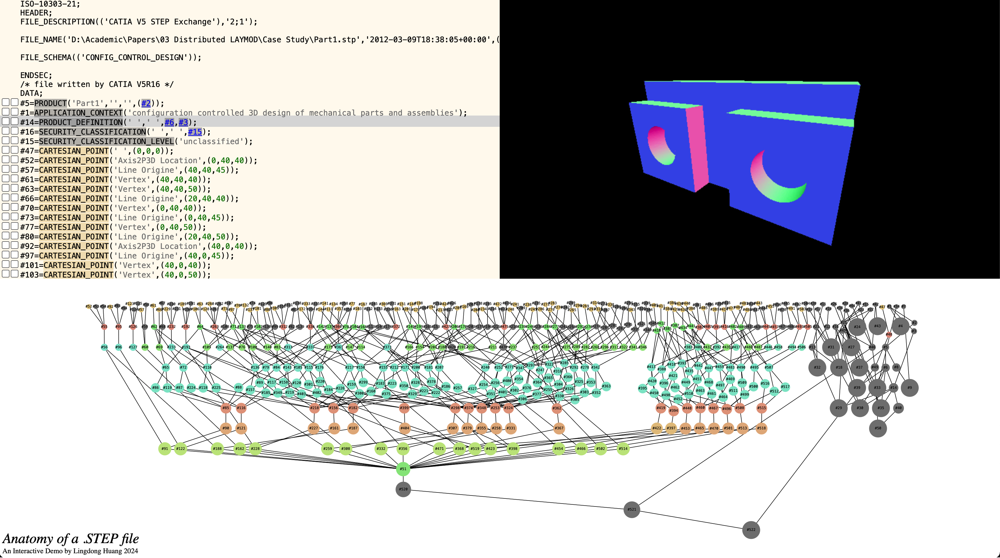

# CAD in 1 Hour

### The Lay of the Land

Computer Aided Design (CAD) tools can be categorized in a variety of different ways.
At a high-level you can separate tools based on how they represent geometry, 
such as whether objects are modeled by their exterior geometry or the interior space the object takes up.
In other words is the object defined by its boundary or its volume.
Is that geometric representation continous or discrete and limited to a particular resolution.

Below we depict some CAD tools categorized by these dimensions (boundary/volume, discrete/continous):


Note that these categorizations are not formal and some tools may blur the lines between them or support multiple
representations. 
For example standard **solid** modeling tools for mechanical engineer (such as SolidWorks or Fusion360) use boundary representations (BREPs).
These tools are designed to create solid models (as the name suggests) with watertight or manifold geometry.
The interfaces restrict users to designing objects which are solid even though the underlying boundary representation can support non-solid geometry.

Another useful categorization of tools is parametric versus direct modeling (or non-parametric).


In direct modeling tools users specify geometry manually, whereas in parametric design
tools geometry can by derived from other features or abstract operations.

Parameterization can take many forms.
One of the most general and common ways of parameterizing systems is simply coding.

Of course programs can be used to represent practically anything, including 3D designs.

This is demonstrated below with a simple OpenSCAD design.


To designers using Rhino parameterization may come from plug-ins such as Grasshopper (or Nodi3D).


A similar dataflow programming environment could be find by an artist using Blender's geometry nodes.


To mechanical engineers parameterization generally comes from geometric constraint solvers and timelines of operations.
We'll have a lot to say about constraint solvrs later in this write-up.


We're going to introduce you to some of the key concepts needed to create design tools.
We will introduce many of these concepts by demonstrating how to implement minimal (but often practical) versions
of them in code (JavaScript!). 
We will cover how to represent solids with analytical distance fields, how to mesh those fields, some history of modern solid modeling CAD tools, BREPs through the context of the step format, and constraint solvers. 

Let's get into it.

### Function Representations/Distance Fields

Perhaps one of the simplest ways to describe an object is with closed form expression.

Let's start in 2D. If we wanted to describe a circle we can just write down the equation for a circle.


Let's do that in a format we can actually make use of.

```js

function circle(x, y, r) {
  return r - Math.sqrt(x**2 + y**2)
}
```

Great but how can we actually see that?

Well the simplest approach would be to pick some sampling resolution.

When the distance is negative we'll consider ourselves inside of the the circle, when positive we'll be outside.

```js
for (let y = 0; y < RESOLUTION; y++) {
  for (let x = 0; x < RESOLUTION; x++) {
    // Normalize the coordinates to [-1, 1]
    // 1/RESOLUTION centers the sample in the cell
    const nx = ((x / RESOLUTION) * 2 - 1) + 1/RESOLUTION;
    const ny = ((y / RESOLUTION) * 2 - 1) + 1/RESOLUTION;

    const inside = sdfFunc(nx, -ny) < 0;
    ctx.fillStyle = '#ff000090'
    const cellSize = Math.min(width, height) / RESOLUTION;
    if (inside)  ctx.fillRect(x*cellSize, y*cellSize, cellSize, cellSize);
  }
}
```

Treating this expression as an inequality rather than a numeric value is typically considered the distinction between a functional representation (FRep) and a SDF (signed distance field).
SDFs are the terminology more commonly used in shader art communities such as (ShaderToy)[https://www.shadertoy.com/].


<div id="frep" class="interactive-demo"></div>

Let's do that in 3D and make a sphere.

```js

function sphereSDF(x, y, z, r) {
  return r - Math.sqrt(x**2 + y**2 + z**2)
}
```

But how can we visualize this sphere in 3D. 
The most common approach is to use ray marching.

__EXPLAIN RAY MARCHING__

__DEMO OF SPHERE__

One of the major advantages of having analytical represenations of our objects is it's very easy to perfrom constructive solid geometry (CSG).
This basically means we can perform boolean algebra on our shapes (intersections, unions, differences).

In code we can express these operations with min and max operations on distances evaluated from two distance fields.

```js
function intersectSDF(distA, distB) {
    return max(distA, distB);
}

function unionSDF(distA, distB) {
    return min(distA, distB);
}

function differenceSDF(distA, distB) {
    return max(distA, -distB);
}
```

Here is a demonstration of applying these operations to our circle and a rectangle.

First we'll need a function to describe a rectangle:

```js
const rectangleSDF = (cx, cy, w, h) => (x, y) => {
    const dx = Math.abs(x-cx) - w / 2;
    const dy = Math.abs(y-cy) - h / 2;

    const outsideDistance = Math.sqrt(Math.max(dx, 0) ** 2 + Math.max(dy, 0) ** 2);
    const insideDistance = Math.min(Math.max(dx, dy), 0);

    return outsideDistance + insideDistance;
}
``` 

Now let's apply each CSG operation to our two shapes:

```js
function myShape(x, y) {
  const myCircle = circle(x, y, 0, 0, 5);
  const myRect = rectangle(x, y, 0, 0, 10, 3);

  return intersectSDF(myCircle, myRect);
}
```

__Display above__

```js
function myShape(x, y) {
  const myCircle = circle(x, y, 0, 0, 5);
  const myRect = rectangle(x, y, 0, 0, 10, 3);

  return unionSDF(myCircle, myRect);
}
```

__Display above__

```js
function myShape(x, y) {
  const myCircle = circle(x, y, 0, 0, 5);
  const myRect = rectangle(x, y, 0, 0, 10, 3);

  return differenceSDF(myCircle, myRect);
}
```

__Display above__

All of the operations work just as well in 3D!
It's also possible to perform non-standard transformations like twists or smooth blends.

__SHOW SMOOTH BLEND__

If we want to do something with our geometry (like transfer it to a slicing program or some other tool) we'll need to convert it to a discretized format.
We can refer to this operation as "meshing" which can be performed in different dimensions.

Let's start by meshing our 2D shape.

A very common algorithm for meshing is called Marching Cubes.

__EXPLAIN MARCHING CUBES__

Run it on our shapes.

We can improve marching cubes by interpolating along the edge of our rules.

__DUAL CONTOURING__

Notice that the corners of our designs are getting lopped off.
We can address this by using the dual graph of our discretized lattice instead.

__DEMO DUAL CONTOURING__


__QUADTREES?__

__SHADER TOY__
__INIGO QUILEZ BLOG__
__HISTORY AT CBA__
__MATT KEETER WORK__

### STLs

Let's run marching cubes in 3D on our sphere. 
This as given us an STL which is basically just a collection of triangles. 

### Voxels

We could generate a different type of 3D representation by filling our solid model with voxels.
This is very similar to how we were rendering our 2D distance fields.

As we demonstrated before there are lots of tools which use these types (SDFs, voxels, meshes) of geometric representations 
but typical solid modeling CAD tools do something different let's dig into what.

### Some (convoluted) CAD History

Solid modeling CAD tools standard for mechanical design can be defined by two technologies which constitute their "kernels": Boundary Representations (B-Reps) and geometric constraint solvers.

B-Reps were introduced by Ian Braid in the 1970s while he was a PhD student at Cambridge University's Computet-Aided Design Group.

He published on this work in his thesis titled _Designing with Volumes_ and also in papers such as [_The Synthesis of Solids Bounded by Many Faces_](./papers/braid-solids.pdf).

Ian took over leading the CAD Group in 1975. 

In 1974 Ian and three colleagues (including Charles Lang and Alan Grayer) created the company Shape Data Ltd to commercialize the CAD groups research. 
Ian joined Shape Data full time in 1980. 
In 1978 the company released Romulus the world's first commercial solid modeling kernel.

In 1986 Ian and two other founders left to start Three-Space Ltd. 
Three-Space Ltd. created ACIS (Alan, Charles, Ian's System)

Interesting ACIS was liscenced to Spatial Corp. which was acquired by Dassault Systemes.

And Shape Data developed Parasolid which was acquired by Siemens.

So to review: 

Alan, Ian and Charles -> Shape Data (Parasolid) -> Siemens

Alan, Ian and Charles -> Three-Space Ltd. (ACIS) -> Spatial Corp. -> Dassault Systemes

ACIS 7.0 was forked -> Autodesk ShapeManager

Dassault Systemes makes Solidworks which uses Parasolid (owned by Siemens).


On top of all this in 1989 D-Cubed Ltd was founded and created DCM (Dimensional Constraint Manager).
This is one of the first commercial geometric constraint solvers and it's now owned by Siemens.

According to [this Hacker News commenter](https://news.ycombinator.com/item?id=30625341) (who worked at D-Cubed) it's also liscenced by most major CAD developers.


On the same thread we also find this comment:


You are in fact not the only one that finds it crazy that these incredibly important technologies seem to be developed and understood by very few. 

Interestingly there were more former D-Cubed Ltd employees wandering the comments sections:


### Boundary Representation (B-Rep)

__GLEN GREY VIDEO__


<!-- <div id="interactive-step" class="interactive-demo"></div> -->

</img>
[Play in Full Screen](https://step-test.glitch.me/)

Boundary representation (BREP) represents a solid by defining the limits of its volume. 

STEP file (ISO-10303) is a common data exchange format for encoding BREP's.

One idea about boundary representation is that you want a solid is watertight and manifold (no holes, fans, stray pieces etc.). 
But since the solid is encoded as a collection of faces, there isn't a real guarentee that what you claim to be a closed shell is actually closed...

Another emphasis is on hierarchical structure. A higher-level entity is parametrically defined by several lower-level entities.

In STEP files, roughly:

- A shell is a bunch of faces
- A face is a surface bounded by some bounds
- A bound consists of a loop of edges
- An edge is a portion of a line or curve, with two vertices
- A line is an origin and a direction
- A vertex is a cartesian coordinate
- The curves can be circles, splines, etc.
- The surfaces can be conical, spherical, etc.

As you can see, STEP files are not afraid to introduce redundencies in order to keep the semantic right. Therefore they also tend to be quite verbose.

For example to encode a simple triangle (just 50 bytes in an STL file), you would have to do something like this:

```js
let c0,c1,c2,v0,v1,v2,l0,l1,l2,d0,d1,d2,e0,e1,e2,r0,r1,r2,o0,o1,o2,el,fb,af,pl,ap,d3;
o.push(`#${c0=id++}=CARTESIAN_POINT('',(${tris[i][0].join(',')}));`);
o.push(`#${c1=id++}=CARTESIAN_POINT('',(${tris[i][1].join(',')}));`);
o.push(`#${c2=id++}=CARTESIAN_POINT('',(${tris[i][2].join(',')}));`);

o.push(`#${v0=id++}=VERTEX_POINT('',#${c0});`);
o.push(`#${v1=id++}=VERTEX_POINT('',#${c1});`);
o.push(`#${v2=id++}=VERTEX_POINT('',#${c2});`);

let a = v_norm(...v_sub(...tris[i][1],...tris[i][0]));
let b = v_norm(...v_sub(...tris[i][2],...tris[i][1]));
let c = v_norm(...v_sub(...tris[i][0],...tris[i][2]));

o.push(`#${d0=id++}=DIRECTION('',(${a.join(',')}));`);
o.push(`#${d1=id++}=DIRECTION('',(${b.join(',')}));`);
o.push(`#${d2=id++}=DIRECTION('',(${c.join(',')}));`);
o.push(`#${d3=id++}=DIRECTION('',(${v_norm(...v_cross(...a,...b)).join(',')}));`);

o.push(`#${r0=id++}=VECTOR('',#${d0},1.0);`);
o.push(`#${r1=id++}=VECTOR('',#${d1},1.0);`);
o.push(`#${r2=id++}=VECTOR('',#${d2},1.0);`);

o.push(`#${l0=id++}=LINE('',#${c0},#${r1});`);
o.push(`#${l1=id++}=LINE('',#${c1},#${r1});`);
o.push(`#${l2=id++}=LINE('',#${c2},#${r2});`);

o.push(`#${e0=id++}=EDGE_CURVE('',#${v0},#${v1},#${l0},.T.);`);
o.push(`#${e1=id++}=EDGE_CURVE('',#${v1},#${v2},#${l1},.T.);`);
o.push(`#${e2=id++}=EDGE_CURVE('',#${v2},#${v0},#${l2},.T.);`);

o.push(`#${o0=id++}=ORIENTED_EDGE('',*,*,#${e0},.T.);`);
o.push(`#${o1=id++}=ORIENTED_EDGE('',*,*,#${e1},.T.);`);
o.push(`#${o2=id++}=ORIENTED_EDGE('',*,*,#${e2},.T.);`);

o.push(`#${el=id++}=EDGE_LOOP('',(#${o0},#${o1},#${o2}));`);
o.push(`#${fb=id++}=FACE_OUTER_BOUND('',#${el},.T.);`);

o.push(`#${ap=id++}=AXIS2_PLACEMENT_3D('',#${c0},#${d3},#${d0});`);
o.push(`#${pl=id++}=PLANE('',#${ap});`);

o.push(`#${af=id++}=ADVANCED_FACE('',(#${fb}),#${pl},.T.);`);
```


The benefit of BREP is that you can manipuate things parametrically in CAD softwares.

For example, if you have a surface and a boundary, you can modify them independently.

Whereas in STL's, there's no semantic information about any feature for manipulation, you only get coordinates about the final shape.


### Geometric Constraint Solvers

Constraint solvers are allow designers to describe geometry based on relationships like coincidence between points, distances, and angles.

There are a variety of approaches to constraint solving which can be surveyed in these papers.

One of the leaders of the field was Christoph M. Hoffmann who spent a majority of his career at Purdue University. 
A majority of the papers linked were written by Christoph and his collaborators.

Broadly constraint solvers can be broken down into

- Algebraic
  - Symbolic
  - Numerical
- Logic Based
- Graph Techniques
  - Constructive

Commerical solvers tend to mix approaches which are optimized for various scenerios.

For general reviews on constraint solving:

[_A Geometric Constraint Solver (1993)_](./papers/geo-solver.pdf)

[_A brief on constraint solving (2004)_](./papers/constraint-brief.pdf)

[_Geometric Constraint Solving in Parametric CAD (2011)_](./papers/geo-constraints-cad.pdf)

[_A review on geometric constraint solving (2022)_](./papers/geo-constraint-review-2022.pdf)

Regarding open source constraint solvers there is [FreeCAD's planegcs](https://github.com/FreeCAD/FreeCAD/tree/main/src/Mod/Sketcher/App/planegcs) 
(which you can find [some discussion about here](https://forum.freecad.org/viewtopic.php?t=26737) and a [WASM port here](https://github.com/Salusoft89/planegcs))
and Solvespace's solver.

One of the best write ups on developing a constraint solver comes from [Solvespace](https://solvespace.com/index.pl). 

Solvespace was created by Jonathan Westhues who wrote his one B-Rep engine and geometric constraint solver from scratch.

Solvespace is an extremely well made small CAD tool that is quite useable though not quite at feature parity with industrial tools.
The primary missing features are the ability to fillet and chamfer geometry after the fact.

Westhues wrote up the inner workings of his [constraint solver here](./papers/sketchflat.pdf).
The document primarily describes a numerical approach to constraint solving.

Another excellent write up by Matt Keeter on a [very simple least-squares gradient descent solver can be found here](https://www.mattkeeter.com/projects/constraints/).

Below I'll describe my own similar approach to numerical constraint solving in much greater detail (and JavaScipt)

__Numerical__

Let's start with a simple constraint system:

- Point A in green is fixed at 0, 0.
- Point B in blue is 10 units away from point A.
- Point C is vertical to Point A.
- Point C is horizontal to Point B.

Let's first think about how we could describe this system algebraically.

- `a_x = 0` and `a_y = 0`
- `sqrt( (b_x - a_x)^2 + (b_y - a_y)^2 ) = 10`
- `c_x = a_x`
- `c_y = b_y`

Now that we have this system of equations how could we go about solving it.

We could try to do so algebraically but this could be challanging as we require more variables.

Instead (as the section title suggests) let's go about it numerically.

This means we are going to use the computer for what it's really good at. 
Doing lots of calculations repeated while attempting to approach a solution.

We will need to first develop a cost function. 
We'll be using the gradient of this function to approach a solution so we want the solution to occur at some sort of extrema point.
Let's use the minimum and the structure our cost function so the absolute minimums occur at 0.
We can guarantee this by setting our equations to 0 and then take the same of each of them squared, so the 4 equations become:

- `a_x - 0 = 0` and `a_y - 0 = 0`
- `sqrt( (b_x - a_x)^2 + (b_y - a_y)^2 ) - 10 = 0`
- `c_x - a_x = 0`
- `c_y - b_y = 0`

Which when all squared and added together become:

```
(a_x - 0)^2 + (a_y - 0)^2 
+ (sqrt( (b_x - a_x)^2 + (b_y - a_y)^2 ) - 10)^2
+ (c_x - a_x)^2
+ (c_y - b_y)^2
= 0
```

To apply gradient descent well also need the gradient at each evalution point.
We can obtain this using [automatic differentiation](./papers/auto-diff.pdf) (in this case forward mode).

Note that the equations above are not written in JavaScript, for convience I found it easier to write my own little differentable calculator language.
The explanation below will explain why this was neccessary (it wasn't, but it did provide some convience).

You can play with this calculator below it supports

- addition: `+`
- subtraction: `-`
- multiplication: `*`
- division: `/`
- negative: `-`
- power (with whole numbers): `^`
- exponentiation (with whole numbers): `exp`
- logarithm (with whole numbers): `log`
- trigonometric functions: `sin`, `cos`, `tan`
- inverse trigonometric functions: `asin`, `acos`, `atan`

__DEMO of differential calculator__

This works by representing numbers as dual numbers, which are pairs a value and it's derivative.

```js
function valder (val, der) {
  return {
    type: "valder",
    val: val,
    der: der,
  }
}
```

We then implement all of our arithmetic operations to work with these dual numbers and encode rules for differentiation into these functions.

For one of the simpler examples let's look at plus.

```js
function plus(x0, x1) {
  if ((typeof x0 === "number") && (typeof x1 === "number") && !isNaN(x0) && !isNaN(x1)) {
    return x0 + x1
  } else if ((x0.type === "valder") || (x1.type === "valder")) {

    if ((typeof x0 === "number") && (typeof x1 !== "number")) {
      x0 = valder(x0, x1.der.map(temp => 0));
    }

    if ((typeof x1 === "number") && (typeof x0 !== "number")) {
      x1 = valder(x1, x0.der.map(temp => 0));
    }

    return valder(plus(x0.val, x1.val), x0.der.map((temp, index) => plus(temp, x1.der[index])))
  }
}
```

Notice how we apply the chain rule when calculating the derivative value for our multiplication function.

```js
function mul(x0, x1) {
  if ((typeof x0 === "number") && (typeof x1 === "number") && !isNaN(x0) && !isNaN(x1)) {
    return x0 * x1
  } else if ((x0.type === "valder") || (x1.type === "valder")) {

    if ((typeof x0 === "number") && (typeof x1 !== "number")) {
      x0 = valder(x0, x1.der.map(temp => 0));
    }

    if ((typeof x1 === "number") && (typeof x0 !== "number")) {
      x1 = valder(x1, x0.der.map(temp => 0));
    }

    return valder(mul(x0.val, x1.val), x1.der.map((temp, index) => plus(mul(temp, x0.val), mul(x1.val, x0.der[index]))));
  }
}
```

You can find the [full automatic differentiation implementation here](./js/autodiff.js).

Now just our distance equation will become 

```js
function distance(d, p0, p1) {

  const p0x = valder(p0[0], [1, 0, 0, 0]); 
  const p0y = valder(p0[1], [0, 1, 0, 0]); 
  const p1x = valder(p1[0], [0, 0, 1, 0]); 
  const p1y = valder(p1[1], [0, 0, 0, 1]);

  return minus(
    d, 
    sqrt(
      plus(
        power(minus(p1x, p0x), 2), 
        power(minus(p1y, p0y), 2)
      )
    )
  );
}
```

which can start to motivate why we want our little language. 
There is still a better reason to come though.

Speaking of which [the parser for the language is available here](./js/parser.js).

The [evaluator for the langauge can be found here](./js/evaluate.js).

It provides us with this evaluate function:

```js
evaluate(equation, variableValues)
```

Which can be used as such:

```js
evaluate("sin(x)", { x: 1 })
```

Okay so now that we can express and evaluate the algebraic representations of our constraints let's solve our constraint problem by minimizing our cost function.

We could use strict gradient descent but there are algorithms that work better with these sorts of non-linear least squares problems.
FreeCAD's solver planegcs gives options to use DogLeg, Levenberg-Marquardt, BFGS or SQP. 
You can find a variety of [non-linear least squares optimization algorithms explained here](./papers/non-linear-least-squares.pdf).

I've found the Levenberg–Marquardt algorithm works quite well.
The Levenberg-Marquardt interpolates between Gauss-Newton and gradient descent.

You can find [the complete implementation of the Levenberg-Marquardt and the numerical equation system solver here](./js/solveSystem.js).

It provides us with this function:

```js

function solveSystem(eqns, vars, ops) {
  ...
}
```

`eqns` is a list of equation strings, 
`vars` is an object of initial guesses of the form `{ "x": 1 }`,
`ops` is optional arguments which include `{ forwardSubs, epsilon }`. 
Note that you can provide a list of forward substitions.
This is one of the primary conviences of our choice to use a little language and to represent our equations as strings. 
We can use string replacement to "symbolically" substitute some variables.
This is convienent for known equality constraints like coincidence, vertical, or horizontal.

So now with all of that we can describe our constrained system like so:

```js
// a helper function for creating distance constraints
function createDistanceConstraint(p0, p1, dist) {
  const p0x = `${p0}_x`;
  const p1x = `${p1}_x`;
  const p0y = `${p0}_y`;
  const p1y = `${p1}_y`;

  return `${dist} - sqrt((${p1x}-${p0x})^2+(${p1y}-${p0y})^2)`
}

const constrainedGeometry = {
    pts: {
      a: { x: 50, y: 50 },
      b: { x: 25,  y: 25 },
      c: { x: 0,  y: 50 }
    },
    constraints: [
      createDistanceConstraint("a", "b", 10),
      "a_x",
      "a_y",
      "c_x - a_x",
      "c_y - b_y"
    ]
}

const initialVals = {};

// break each point into its x and y variables
Object.entries(constrainedGeometry.pts).forEach(([id, pt]) => {
  initialVals[`${id}_x`] = pt.x;
  initialVals[`${id}_y`] = pt.y;
});

const [ satisfied, solutions ] = solveSystem(
  constrainedGeometry.constraints, 
  initialVals
);

// update the geometry
Object.entries(solutions).forEach(([id, val]) => {
  const [ptId, xy] = id.split("_");
  constrainedGeometry.pts[ptId][xy] = val;
});
```

One of the benefits of this approach and having to provide an initial guess is that we can inform that guess from user interaction.
If a user drags a piece of geometry and we set the initial guess to that target we will likely find a solution near where the user requested.
This can make the solver feel more intuitive to use.

__DEMO OF SYSTEM DESCRIBED__

Show variety of constraint equations

__Graph Constructive__

As previously mentioned the first commerical constraint solver was developed by D-Cubed Ltd (once again based in Cambridge).
D-Cubed was founded by John Owen and based their solver 2D DCM on work developed by Owen
and described in his 1991 paper [_Algebraic Solution for Geometry from Dimensional Constraints_](./papers/owen-constraints.pdf)


