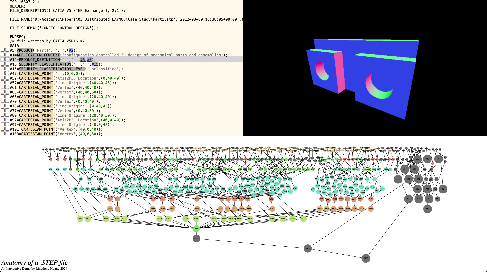

# Boundary Representation (B-Rep)

B-Reps were developed simultanously and independently in the 1970s by Ian Braid at Cambridge and Bruce Baumgart at Stanford.
Baumgart was interested in computer vision applications while Braid was interested in developing CAD tools.

One of the best [short explainers I can find on B-Reps is by Glen Grey](https://www.youtube.com/watch?v=sXbRT439vRI), a seemingly retired CAD developer who 
creates educational youtube videos.

</img>
[Play in Full Screen](https://step-test.glitch.me/)

Boundary representation (BREP) represents a solid by defining the limits of its volume. 

STEP file (ISO-10303) is a common data exchange format for encoding BREP's.

One idea about boundary representation is that you want a solid is watertight and manifold (no holes, fans, stray pieces etc.). 
But since the solid is encoded as a collection of faces, there isn't a real guarentee that what you claim to be a closed shell is actually closed...

Another emphasis is on hierarchical structure. A higher-level entity is parametrically defined by several lower-level entities.

In STEP files, roughly:

- A shell is a bunch of faces
- A face is a surface bounded by some bounds
- A bound consists of a loop of edges
- An edge is a portion of a line or curve, with two vertices
- A line is an origin and a direction
- A vertex is a cartesian coordinate
- The curves can be circles, splines, etc.
- The surfaces can be conical, spherical, etc.

As you can see, STEP files are not afraid to introduce redundencies in order to keep the semantic right. Therefore they also tend to be quite verbose.

For example to encode a simple triangle (just 50 bytes in an STL file), you would have to do something like this:

```js
let c0,c1,c2,v0,v1,v2,l0,l1,l2,d0,d1,d2,e0,e1,e2,r0,r1,r2,o0,o1,o2,el,fb,af,pl,ap,d3;
o.push(`#${c0=id++}=CARTESIAN_POINT('',(${tris[i][0].join(',')}));`);
o.push(`#${c1=id++}=CARTESIAN_POINT('',(${tris[i][1].join(',')}));`);
o.push(`#${c2=id++}=CARTESIAN_POINT('',(${tris[i][2].join(',')}));`);

o.push(`#${v0=id++}=VERTEX_POINT('',#${c0});`);
o.push(`#${v1=id++}=VERTEX_POINT('',#${c1});`);
o.push(`#${v2=id++}=VERTEX_POINT('',#${c2});`);

let a = v_norm(...v_sub(...tris[i][1],...tris[i][0]));
let b = v_norm(...v_sub(...tris[i][2],...tris[i][1]));
let c = v_norm(...v_sub(...tris[i][0],...tris[i][2]));

o.push(`#${d0=id++}=DIRECTION('',(${a.join(',')}));`);
o.push(`#${d1=id++}=DIRECTION('',(${b.join(',')}));`);
o.push(`#${d2=id++}=DIRECTION('',(${c.join(',')}));`);
o.push(`#${d3=id++}=DIRECTION('',(${v_norm(...v_cross(...a,...b)).join(',')}));`);

o.push(`#${r0=id++}=VECTOR('',#${d0},1.0);`);
o.push(`#${r1=id++}=VECTOR('',#${d1},1.0);`);
o.push(`#${r2=id++}=VECTOR('',#${d2},1.0);`);

o.push(`#${l0=id++}=LINE('',#${c0},#${r1});`);
o.push(`#${l1=id++}=LINE('',#${c1},#${r1});`);
o.push(`#${l2=id++}=LINE('',#${c2},#${r2});`);

o.push(`#${e0=id++}=EDGE_CURVE('',#${v0},#${v1},#${l0},.T.);`);
o.push(`#${e1=id++}=EDGE_CURVE('',#${v1},#${v2},#${l1},.T.);`);
o.push(`#${e2=id++}=EDGE_CURVE('',#${v2},#${v0},#${l2},.T.);`);

o.push(`#${o0=id++}=ORIENTED_EDGE('',*,*,#${e0},.T.);`);
o.push(`#${o1=id++}=ORIENTED_EDGE('',*,*,#${e1},.T.);`);
o.push(`#${o2=id++}=ORIENTED_EDGE('',*,*,#${e2},.T.);`);

o.push(`#${el=id++}=EDGE_LOOP('',(#${o0},#${o1},#${o2}));`);
o.push(`#${fb=id++}=FACE_OUTER_BOUND('',#${el},.T.);`);

o.push(`#${ap=id++}=AXIS2_PLACEMENT_3D('',#${c0},#${d3},#${d0});`);
o.push(`#${pl=id++}=PLANE('',#${ap});`);

o.push(`#${af=id++}=ADVANCED_FACE('',(#${fb}),#${pl},.T.);`);
```


The benefit of BREP is that you can manipuate things parametrically in CAD softwares.

For example, if you have a surface and a boundary, you can modify them independently.

Whereas in STL's, there's no semantic information about any feature for manipulation, you only get coordinates about the final shape.


