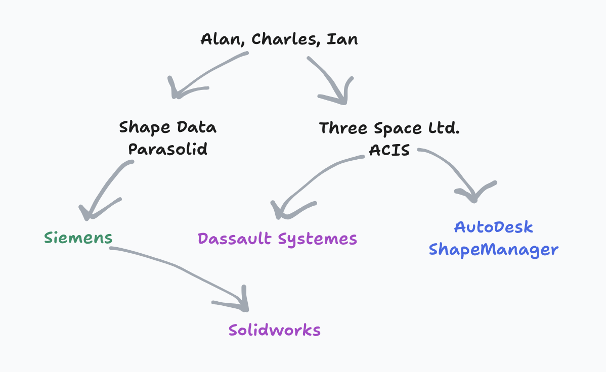
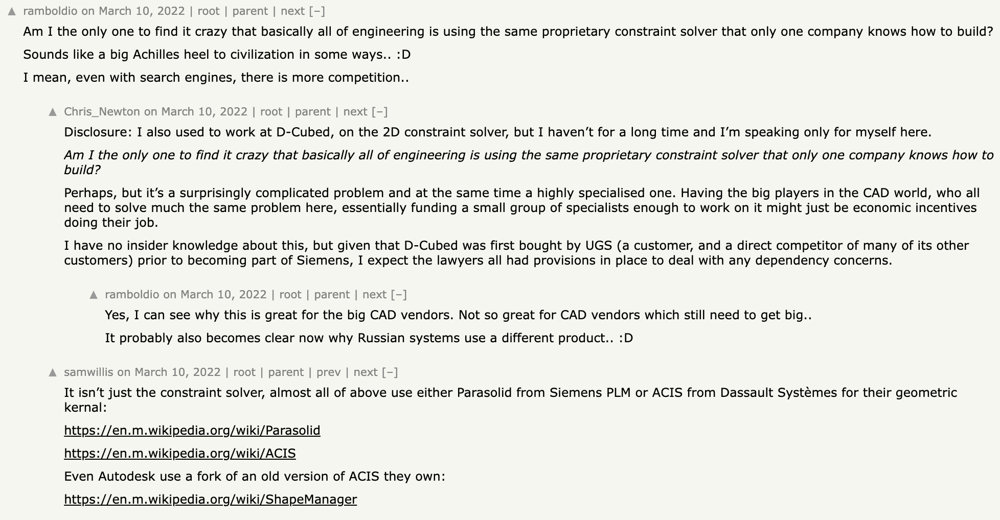

# Some (convoluted) CAD History

Solid modeling CAD tools standard for mechanical design can be defined by two technologies which constitute their "kernels": Boundary Representations (B-Reps) and geometric constraint solvers.

B-Reps were introduced by Ian Braid in the 1970s while he was a PhD student at Cambridge University's Computet-Aided Design Group.

He published on this work in his thesis titled _Designing with Volumes_ and also in papers such as [_The Synthesis of Solids Bounded by Many Faces_](https://dl.acm.org/doi/pdf/10.1145/360715.360727).

Ian took over leading the CAD Group in 1975.

In 1974 Ian and three colleagues (including Charles Lang and Alan Grayer) created the company Shape Data Ltd to commercialize the CAD groups research.
Ian joined Shape Data full time in 1980.
In 1978 the company released Romulus the world's first commercial solid modeling kernel.

In 1986 Ian and two other founders left to start Three-Space Ltd.
Three-Space Ltd. created ACIS (Alan, Charles, Ian's System)

Interestingly ACIS was licensed to Spatial Corp. which was acquired by Dassault Systemes.

And Shape Data developed Parasolid which was acquired by Siemens.

So to review:

Alan, Ian and Charles -> Shape Data (Parasolid) -> Siemens

Alan, Ian and Charles -> Three-Space Ltd. (ACIS) -> Spatial Corp. -> Dassault Systemes

ACIS 7.0 was forked -> Autodesk ShapeManager

Dassault Systemes makes Solidworks which uses Parasolid (owned by Siemens).

On top of all this in 1989 D-Cubed Ltd was founded and created DCM (Dimensional Constraint Manager).
This is one of the first commercial geometric constraint solvers and it's now owned by Siemens.

According to [this Hacker News commenter](https://news.ycombinator.com/item?id=30625341) (who worked at D-Cubed) it's also liscenced by most major CAD developers.

On the same thread we also find this comment:

You are in fact not the only one that finds it crazy that these incredibly important technologies seem to be developed and understood by very few.

Interestingly there were more former D-Cubed Ltd employees wandering the comments sections:

There are a few open source CAD kernels.
Among them the most feature complete and robust is [OpenCASCADE](https://www.opencascade.com/).
OpenCASCADE has a [web assembly port](https://github.com/donalffons/opencascade.js) which you can see in action in [CascadeStudio](https://zalo.github.io/CascadeStudio/).

There are some impressive individuals who have also made their own CAD programs including Solvespace which I'll discuss more later
and [JSketcher](https://github.com/xibyte/jsketcher).

[Previous: Meshes](./#mesh-voxel)

[Next: Constraints](./#constraints)
