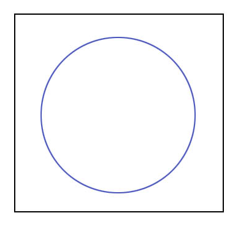

# Function Representations/Distance Fields

Perhaps one of the simplest ways to describe an object is with closed form expression.

Let's start in 2D. If we wanted to describe a circle we can just write down the equation for a circle.


Let's do that in a format we can actually make use of. 
In JavaScript it will look like this:

```js
function circle(x, y, radius) => {
  return Math.sqrt(x**2 + y**2) - radius**2;
}
```

I'm going to rewrite this as a higher order function so we can apply tranformations to our SDF.

```js
const circle = (radius) => (x, y) => {
  return Math.sqrt(x**2 + y**2) - radius**2;
}
```

Great but how can we actually see that?

Well the simplest approach would be to pick some sampling resolution.

When the distance is negative we'll consider ourselves inside of the the circle, when positive we'll be outside.

```js
for (let y = 0; y < RESOLUTION; y++) {
  for (let x = 0; x < RESOLUTION; x++) {
    // Normalize the coordinates to [-1, 1]
    // 1/RESOLUTION centers the sample in the cell
    const nx = ((x / RESOLUTION) * 2 - 1) + 1/RESOLUTION;
    const ny = ((y / RESOLUTION) * 2 - 1) + 1/RESOLUTION;

    const inside = sdfFunc(nx, ny) < 0;
    ctx.fillStyle = '#ff000090'
    const cellSize = Math.min(width, height) / RESOLUTION;
    if (inside)  ctx.fillRect(x*cellSize, y*cellSize, cellSize, cellSize);
  }
}
```

Treating this expression as an inequality rather than a numeric value is typically considered the distinction between a functional representation (FRep) and a SDF (signed distance field).
SDFs are the terminology more commonly used in shader art communities such as [Shader Toy](https://www.shadertoy.com/).

<div id="frep" class="interactive-demo"></div>

In this demo circle creates an SDF which takes x and y.
We return that SDF and it get's rendered to the screen.
If we want to move our shape we can just adjust x and y. 

<div id="frep-trans" class="interactive-demo"></div>

We can create a translate function which takes an SDF and applies this operation to the `x` and `y`
that are passed to it.

```js
const translate = (sdf, dx, dy) => {
  return (x, y) => sdf(x+dx, y+dy);
}
```

<div id="frep-trans-func" class="interactive-demo"></div>

One of the major advantages of having analytical represenations of our objects is it's very easy to perfrom constructive solid geometry (CSG).
This basically means we can perform boolean algebra on our shapes (intersections, unions, differences).

The image below depicts CSG in 3D.


We'll demonstrate how to apply these operations to SDFs in 2D.
The approach generalizes to a third dimension without any changes.

In code we can express these boolean operations with min and max operations on distances evaluated from two distance fields.

```js
function intersectSDF(distA, distB) {
    return max(distA, distB);
}

function unionSDF(distA, distB) {
    return min(distA, distB);
}

function differenceSDF(distA, distB) {
    return max(distA, -distB);
}
```

Here is a demonstration of applying these operations to our circle and a rectangle.

First we'll need a function to describe a rectangle:

```js
const rectangleSDF = (cx, cy, w, h) => (x, y) => {
    const dx = Math.abs(x-cx) - w / 2;
    const dy = Math.abs(y-cy) - h / 2;

    const outsideDistance = Math.sqrt(Math.max(dx, 0) ** 2 + Math.max(dy, 0) ** 2);
    const insideDistance = Math.min(Math.max(dx, dy), 0);

    return outsideDistance + insideDistance;
}
``` 

Now let's apply each CSG operation to our two shapes:

<div id="frep-union" class="interactive-demo"></div>


<div id="frep-difference" class="interactive-demo"></div>


<div id="frep-intersection" class="interactive-demo"></div>

It's also possible to perform non-standard transformations like twists or smooth blends.

__SHOW SMOOTH BLEND__

Notice that with certain sampling resolutions we have quite a lot of error.

<div id="frep-sampling-issue" class="interactive-demo"></div>

### Improved Sampling (Intervals and Quadtrees)

One issue is that cells in the sampling lattice are checked at a specific point. 
A possible solution to this would be to perform membership tests on intervals.
This is depicted in this image from [Adrian Bowyer](http://academy.cba.mit.edu/classes/old/cad_cam_cae/Bowyer.pdf).


We can more efficiently store our cells in recusrive data structure like a quadtree ([images from here](https://groups.csail.mit.edu/graphics/classes/6.837/F98/talecture/)).

<div style="display: flex; overflow: auto; border: 1px solid black; border-radius: 4px;">
  
  
  
  
</div>

If we want to do something with our geometry (like transfer it to a slicing program or some other tool) we'll need to convert it to a discretized format.
We can refer to this operation as "meshing" or "contouring" which can be performed in different dimensions.

Let's start by contouring our 2D shape.

### Marching Squares

A very common algorithm for contouring is called Marching Squares.
The algorithm is explained very clearly below.


Notice how one can improve marching cubes by interpolating along the edge of our rules.

Also notice one of the issues with the approach.
The corners of our designs are getting lopped off.
We can address this issue by applying dual contouring.
[Matt Keeter did an excellent write up explaining the approach here](https://www.mattkeeter.com/projects/contours/).

Much like everything else we've described regarding F-Reps, both Marching Squares and Dual Contouring can be generalized to 3D.

### 3D

Let's generalize our 2D circle to 3D.

```js

function sphereSDF(x, y, z, r) {
  return r - Math.sqrt(x**2 + y**2 + z**2)
}
```


But how can we actually visualize this sphere in 3D (rather than [borrowing an image from Twitter](https://twitter.com/yongyuanxi/status/1354484070865113096/photo/1)). 
The most common approach is to use ray marching.

### Rendering 3D F-Reps/SDFs

The idea behind ray marching on SDF's is very simple but clever. 

You shoot out a whole bunch of rays from your eyes, and let the rays hit stuff in the world.

You shoot one ray for each pixel on the screen. And the information about what and how something is hit by that ray determines the pixel's color.

The SDF gives you the distance to the surface, at any given point in space. So you know how far away you are from hitting something. If you're far away, you can stride faster, and if you're almost hitting stuff, you go in tinier steps until you hit the stuff.

You can see a visual depiction of ray marching in the image below from [GPU Gems](https://developer.nvidia.com/gpugems/gpugems2/part-i-geometric-complexity/chapter-8-pixel-displacement-mapping-distance-functions).


This will give you a distance to the stuff you're gonna hit, from the eye, for each pixel.

Then by looking at the SDF values of the local vicinity of the point of collision, you can calculate the normal at that point.

With a normal, now you can calculate all sorts of shadings to make the final rendering look realistic.

You can read more about this approach in this great blog post by [Jamie Wong](https://jamie-wong.com/2016/07/15/ray-marching-signed-distance-functions/).

### Great work with F-Reps/SDFs

Many of the internets greatest resources on SDFs come from Inigo Quilez. 
He is one of the creators of [Shader Toy](https://www.shadertoy.com/) which is an online editor for fragment shader art and a community of artists who create that style of work.

Quilez has also written a number of blogs explaing SDF concepts in [2D](https://iquilezles.org/articles/distfunctions2d/) and [3D](https://iquilezles.org/articles/distfunctions/).
Note that these tutorials are written for shaders (so the calculations are done in parallel).

Occasionally he also makes magical YouTube videos like [this demonstratin of creating the Selfie Girl below](https://www.youtube.com/watch?v=8--5LwHRhjk).


Here is [another example of one of Quilez's artworks](https://www.shadertoy.com/view/ld3Gz2).


The game making game [Dreams by Media Molecule](https://www.youtube.com/watch?v=2ltgkcoQzow&feature=youtu.be)
uses distance fields underneath the hood. Below you can see an impressive sculpting video.


You can see Alex Evans, co-founder and former CTO of Media Molecule now at NVIDIA, 
[speak at Umbra Ignite in 2015 about developing dreams](https://www.youtube.com/watch?v=u9KNtnCZDMI).

The CBA has also worked on developing F-Rep modeling tools.
Matt Keeter created a nice timeline of some of this work (in addition to being a major contributor to it).


Note that not all of these tools are F-Rep specific. 
Some that were though were Neil's python circuit designs, [Antimony](https://www.mattkeeter.com/projects/antimony/3/) by Matt, and [Matt's master's thesis work](https://cba.mit.edu/docs/theses/13.05.Keeter.pdf).

Matt continued this work ultimately developing [LibFive](https://libfive.com/) which is used in [NTop](https://www.ntop.com/).

