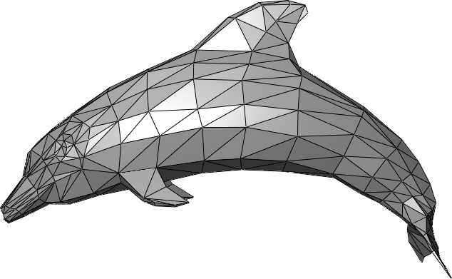
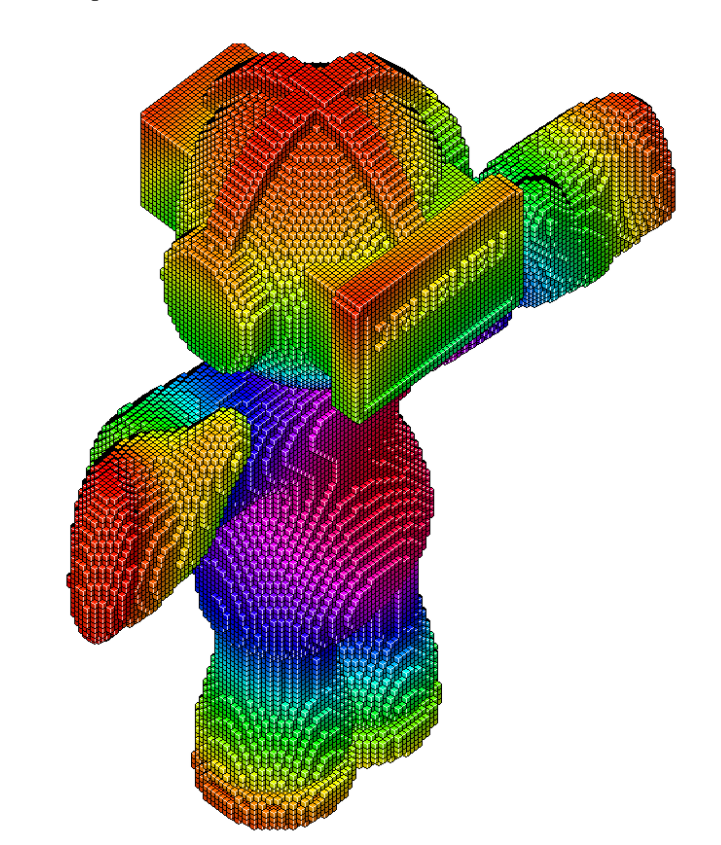
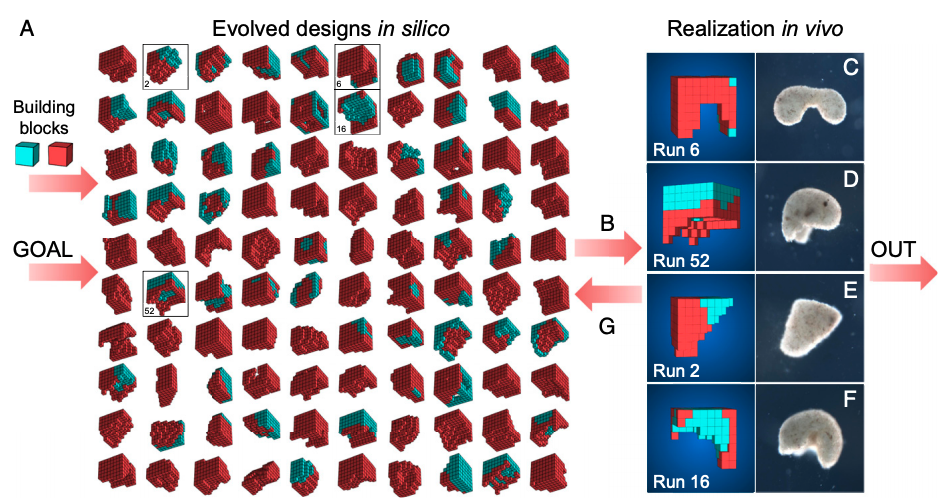

# Meshes (STLs)

This is one of the simplest and most common ways to represent shapes in 3D, it's basically just a collection of triangles.

Meshes are used in popular 3D modeling tools like Blender and can be expressive and flexible to work with.
The issue with meshes for modeling physical objects is that it's easy to generate non-manifold geometry (or non-watertight).
This means you can easily make things which can't really exist in the real world
(imagine a 2D plane cutting through a face).
Mesh modeling tools are very popular partially because this quality isn't as much of a problem when making
assets for virtual worlds (like video games or movies).
For the real world designers tend to prefer volumetric or solid modeling tools.

# Voxels

Voxels are another conceptually simple way to model solids.
We just fill our shape with little cells on a lattice.
This is very similar to how we were rendering our 2D distance fields.
Voxels are basically pixels in 3D.

It can be useful to model in voxels if you have to perform calculations over the model (like physics simulations).

Some examples of this are:

- [VoxCad](https://www.creativemachineslab.com/voxcad.html)
- [Metamaterial Mechanisms](https://jfrohnhofen.github.io/metamaterial-mechanisms/) described in [this paper](http://make.berkeley.edu/readings/metamaterials.pdf)
- [OpenVCAD from MAC Lab](https://www.youtube.com/watch?v=A6CZfp27VQM)
- [Amoeba](https://amanda.pages.cba.mit.edu/AMOEBA/) developed by [Amanda](https://amandaghassaei.com/) at the CBA

Amanda describes modeling functional materials in [her master's thesis](https://cba.mit.edu/docs/theses/16.08.Ghassaei.pdf).

One interesting application of Voxel design has been to make synthetic organisms as
described in [_A scalable pipeline for designing reconfigurable organisms (2019)_](https://www.pnas.org/doi/epdf/10.1073/pnas.1910837117).

You can see a figure from the paper below.

As we demonstrated before there are lots of tools which use these types (SDFs, voxels, meshes) of geometric representations
but typical solid modeling CAD tools do something different let's dig into what.

The authors of this work have also founded [The Institute for Computationally Designed Organisms (ICDO)](https://icdorgs.org/).

[Previous: F-Rep](./#frep)

[Next: CAD History](./#cad-history)
